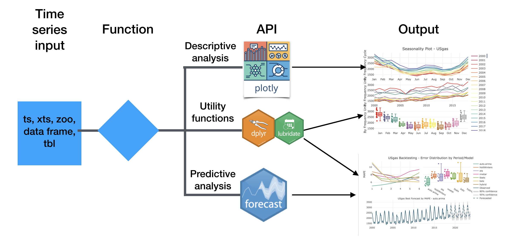

```{r setup, include=FALSE}
options(htmltools.dir.version = FALSE)
knitr::opts_chunk$set(warning = FALSE, message = FALSE)
setwd("/Users/rami/packages/Slides/BARUG Dec 2018/")
load("backtesting.RData")

ts_sim <- function(model, h, n){
  s <- NULL
  s <- lapply(1:n, function(i){
    sim <- NULL
    sim <- stats::simulate(model,nsim = h)
    sim_df <- base::data.frame(x = stats::time(sim), y = base::as.numeric(sim))
    return(sim_df)
  }) 
  
  p <- plotly::plot_ly()
  
  for(i in 1:n){
    p <- p %>% plotly::add_lines(x = s[[i]]$x, y = s[[i]]$y, line = list(color = "blue"), opacity = 0.05)
  }
  s1 <- s %>% dplyr::bind_rows() %>% dplyr::group_by(x) %>%
    dplyr::summarise(p50 = median(y))
  p <- p %>% plotly::add_lines(x = s1$x, y = s1$p50, 
                               
                               line = list(color = "black", 
                                           dash = "dash", 
                                           width = 3)) 
  
  p <- p %>% plotly::add_lines(x = time(model$x), y = model$x, line = list(color = "#00526d")) %>% plotly::hide_legend()
  
  return(p)
}
```

```{r global_options, include=FALSE}
knitr::opts_chunk$set(fig.width=8, fig.height=4)
set.seed(1234)
```


class: inverse

## Agenda

- Introduction

- Utility functions

- Visualization tools

- Seasonal analysis

- Forecasting applications

- Road map

---

class: inverse, center, middle

# Any experince with time series analysis? forecast and plotly packages?

---
class: inverse

## Introduction

The **TSstudio** package provides a set of functions for time series analysis and forecasting such as:

- Utility functions for pre-processing time series data
- Interactive data visualization tools for descriptive analysis, based on the **plotly** package engine
- Set of functions for predictive analysis and forecasting automation with the use of models from the **forecast**, **forecastHybrid**, and **bsts** packages

The primary goal of the package is to simplify the analysis workflow (or, minimum code - maximum results) 

---

class: inverse

## Package structure




---
class: inverse

# Installation

Install from [CRAN](https://cran.r-project.org/web/packages/TSstudio/index.html):

```{r eval=FALSE, tidy=FALSE}
install.packages("TSstudio")
```

Or from [Github](https://github.com/RamiKrispin/TSstudio):

```{r eval=FALSE, tidy=FALSE}
devtools::install_github("RamiKrispin/TSstudio")
```

```{r}
library(TSstudio)
```

---
class: inverse

# Utility functions

The `ts_info` returns the main characteristics of the series:

```{r}
data("USVSales")
ts_info(USgas)

data("Michigan_CS")
ts_info(Michigan_CS)
```


---
class: inverse

# Visualize time series data

```{r}
library(TSstudio)

data(USgas)

ts_info(USgas)
```


---
class: inverse

# Visualize time series data

```{r}
ts_plot(USgas)
```

---
class: inverse

# Visualize time series data

```{r}
ts_plot(USgas,
        title = "Monthly Natural Gas Consumption in the US", # Adding title
        slider = TRUE, # Adding slider
        Ytitle = "Billion Cubic Feet", # Adding Y-axis title
        color = "green") # Setting the line 
```
