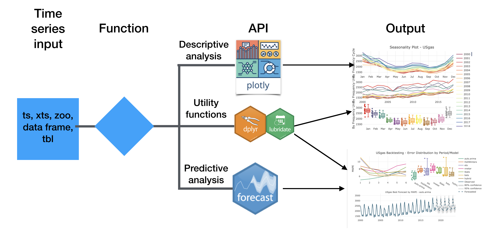

```{r setup, include=FALSE}
options(htmltools.dir.version = FALSE)
knitr::opts_chunk$set(warning = FALSE, message = FALSE)
setwd("/Users/rami/packages/Slides/East Bay R Users Group Feb 2019/")
load("/Users/rami/packages/Slides/East Bay R Users Group Feb 2019/fc.RData")
source("/Users/rami/packages/Slides/East Bay R Users Group Feb 2019/plotting backtesting obj.R")
```

```{r global_options, include=FALSE}
knitr::opts_chunk$set(fig.width=12, fig.height=5)
set.seed(1234)
```


## Agenda

- Introduction

- Key functions

- Demo

- Work on Progress


## Any experince with time series analysis? 

- forecast package?
- plotly package?

## Introduction

The **TSstudio** package provides a set of functions for time series analysis and forecasting such as:

- Utility functions for pre-processing time series data
- Interactive data visualization tools for descriptive analysis, based on the **plotly** package engine
- Set of functions for predictive analysis and forecasting automation with the use of models from the **forecast**, **forecastHybrid**, and **bsts** packages

The primary goal of the package is to simplify the analysis workflow (or, minimum code - maximum results) 

## Installation

Install from [CRAN](https://cran.r-project.org/web/packages/TSstudio/index.html):

```{r eval=FALSE, tidy=FALSE}
install.packages("TSstudio")
```

Or from [Github](https://github.com/RamiKrispin/TSstudio):

```{r eval=FALSE, tidy=FALSE}
devtools::install_github("RamiKrispin/TSstudio")
```


## Package structure


```{r echo=FALSE, out.width="850px"}

```


## Key functions

- Data visualization tools
- Seasonal analysis
- Correlation analysis
- Forecasting applications


## Demo


## Work on progress - next release

Forecast simulation

```{r}
library(forecast)
library(TSstudio)
data(USgas)
md <- auto.arima(USgas)

fc_sim <- forecast_sim(md, h = 60, n = 200)
```

## Work on progress - next release

Forecast simulation

```{r fig.height=5, fig.width=8}
fc_sim$plot
```

## Work on progress - next release

HoltWinters tuning parameters with grid search

```{r}
hw_grid_shallow <- ts_grid(ts.obj = USgas,
                            periods = 6,
                            model = "HoltWinters",
                            optim = "MAPE",
                            window_space = 6,
                            window_test = 12,
                            hyper_params = list(alpha = seq(0.01, 1,0.1),
                                                beta =  seq(0.01, 1,0.1),
                                                gamma = seq(0.01, 1,0.1)),
                            parallel = TRUE,
                            n.cores = 8)
```


## Work on progress - next release

HoltWinters tuning parameters with grid search

```{r fig.height=4, fig.width=6}
plot_grid(hw_grid_shallow, type = "parcoords")
```


## Work on progress - next release

HoltWinters tuning parameters with grid search

```{r fig.height=4, fig.width=6}
plot_grid(hw_grid_shallow, type = "3D", top = 200)
```

## Work on progress - next release

Backtesting with both expending and sliding windows and parallel option

```{r, eval=FALSE}
fc <- ts_test(ts.obj = USgas,
             window_type = "expending",
             h = 60,
             window_space = 6,
             window_test = 12,
             parallel = TRUE,
             n_cores = 8,
             top = 6)
```

## Work on progress - next release

Backtesting with both expending and sliding windows and parallel option

```{r fig.height=4, fig.width=7}
plot_backtesting(fc,by = "MAPE", type = "all", palette = "viridis", top = NULL)
```

## Questions?

## Thank you!